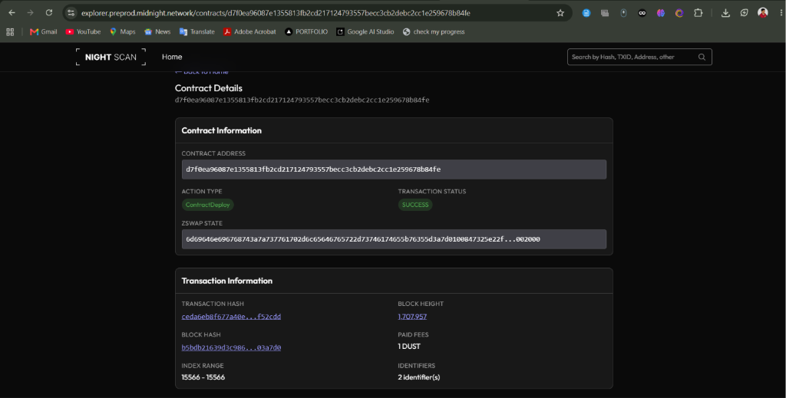
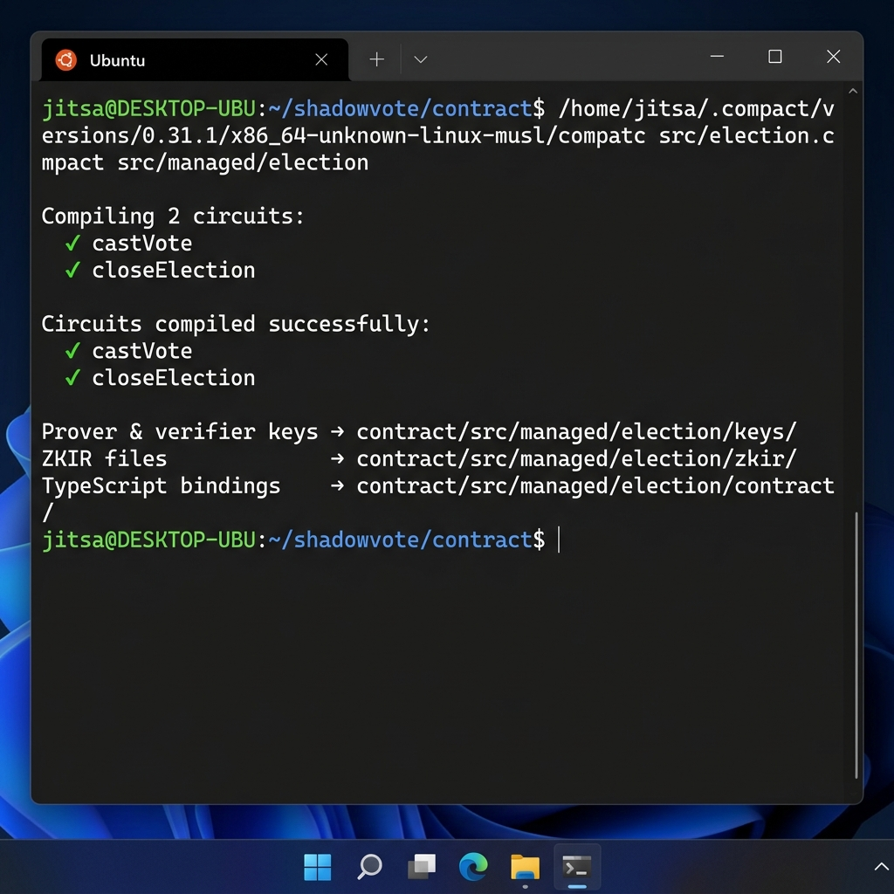

<p align="center">
  
  
  
  
  
  
</p>

<h1 align="center">🗳️ ShadowVote</h1>
<h3 align="center">Private Zero-Knowledge Election System on Midnight Network</h3>

<p align="center">
  <i>Cast anonymous, mathematically verified ballots without revealing your identity, wallet address, or candidate choice — to anyone.</i>
</p>

<p align="center">
  <a href="https://private-election-system-dapp.vercel.app/">
    
  </a>
</p>

---

## 🎬 Demo Video

<p align="center">
  <a href="https://drive.google.com/file/d/1j5HblgAsokcVRnntsQVyWIrtLGdOjPeJ/view?usp=drive_link">
    
    <br/>
    
  </a>
</p>

---

## 💡 Product Vision

> **ShadowVote** solves the trust, anonymity, and coercion-resistance problems plaguing decentralized governance. By combining off-chain Merkle membership trees with on-device zero-knowledge proving, organizations — DAOs, corporate boards, private committees — can run verified elections where members prove they are on the eligible voter list and have not voted yet, without revealing their wallet address, identity, or specific candidate choice to anyone, including administrators.

---

## ✨ Key Features

| Feature | Description |
|---|---|
| 🔒 **True Anonymity** | Votes are cast via ZK proofs. No one can link a ballot to a voter's identity or wallet. |
| 🌳 **Scalable Off-Chain Merkle Trees** | Supports 500+ voters via depth-10 Merkle trees built off-chain, keeping gas fees minimal. |
| ⚡ **Local Merkle Path Resolution** | The voter booth computes the ZK membership path entirely in the browser — fully decentralized. |
| 📦 **Bulk Voter Import & Mock Generator** | Upload CSV/JSON files, bulk-paste commitments, or generate 1,000 mock credentials in one click. |
| 🔑 **Self-Generated Voter Credentials** | Voters generate private keys locally and share only public commitment hashes. |
| 🛡️ **Cryptographic Double-Vote Prevention** | Deterministic nullifiers from `hash(secret, electionId)` block duplicate ballots while preserving privacy. |
| 🌗 **Dark & Light Mode** | Seamless system-aware theme toggling with persistent user preference. |

---

## 🏛️ Architecture Overview

```
┌─────────────────────────────────────────────────────────────────────┐
│                        VOTER'S BROWSER                              │
│  ┌──────────────┐  ┌──────────────────┐  ┌────────────────────┐    │
│  │ Secret Key   │  │ Merkle Path      │  │ Selected Candidate │    │
│  │ (Private)    │  │ (Private)        │  │ (Private)          │    │
│  └──────┬───────┘  └────────┬─────────┘  └─────────┬──────────┘    │
│         │                   │                      │               │
│         └───────────┬───────┴──────────────────────┘               │
│                     ▼                                               │
│         ┌──────────────────────┐                                    │
│         │   ZK PROOF GENERATOR │  ← Runs entirely on-device        │
│         │   (Compact Circuit)  │                                    │
│         └──────────┬───────────┘                                    │
│                    │                                                │
└────────────────────┼────────────────────────────────────────────────┘
                     │  Proof (no private data leaked)
                     ▼
┌─────────────────────────────────────────────────────────────────────┐
│                     MIDNIGHT BLOCKCHAIN                              │
│                                                                     │
│   allowlistRoot ─── Merkle root of eligible voters (public)         │
│   tallies ───────── Vote counts per candidate (public)              │
│   nullifiers ────── Spent nullifier hashes (public)                 │
│   votingClosed ──── Election open/closed flag (public)              │
│                                                                     │
│   ⚠️  NO voter identities, NO wallet links, NO vote choices stored  │
└─────────────────────────────────────────────────────────────────────┘
```

---

## ⚡ Public State vs. Private Witness

Midnight enforces a strict separation between **public on-chain ledger state** and **private client-side witness data**. This is the core privacy mechanism:

### 🔓 Public State (On-Chain — Visible to All)

| Variable | Type | Purpose |
|---|---|---|
| `allowlistRoot` | `Field` | Merkle root of eligible voter commitments. Verifies membership proofs. |
| `votingClosed` | `Boolean` | Flag indicating whether the election accepts votes. |
| `tallies` | `Map<Uint<256>, Field>` | Accumulated vote counts per candidate index. |
| `nullifiers` | `Map<Bytes<32>, Null>` | Set of spent nullifier hashes preventing double-voting. |

### 🔐 Private Witness (Client-Side — Never Leaves Device)

| Witness | Type | Purpose |
|---|---|---|
| Voter Secret Key | `Bytes<32>` | Computes the voter's public commitment and unique nullifier. |
| Merkle Path | `MerkleTreePath` | Proves the voter's commitment exists under the on-chain `allowlistRoot`. |
| Selected Option | `Uint<8>` | The candidate index the voter is voting for. |

### How the ZK Circuit Works

Inside `castVote`, the prover uses private witnesses to generate a proof that:

1. **Membership** — The prover knows a secret whose commitment is in the Merkle tree
2. **Root Match** — The Merkle path resolves to the contract's public `allowlistRoot`
3. **Uniqueness** — The derived nullifier `hash(secret, electionId)` hasn't been spent
4. **Validity** — The vote is added to the correct candidate tally

> The verifier (blockchain) confirms all of the above **without ever learning the secret, the path, or the vote choice**.

---

## 🛠️ Technology Stack

| Layer | Technology |
|---|---|
| **Smart Contract** | [Compact](https://compact.midnight.network/) — Midnight's ZK contract language |
| **Frontend** | Next.js 16 · TypeScript · Tailwind CSS v4 · Lucide Icons |
| **Design System** | Coinbase Institutional Editorial Style (light/dark adaptive) |
| **Wallet SDK** | `@midnight-ntwrk/midnight-js` · `@midnight-ntwrk/dapp-connector-api` |
| **Cryptography** | Poseidon hashing · Merkle commitment trees · ZK-SNARK circuits |
| **Testing** | Vitest · Pure circuit unit tests |

---

## 📁 Repository Structure

```
shadowvote/
│
├── contract/                          # ZK Smart Contract (Compact)
│   ├── src/
│   │   ├── election.compact           # The ZK smart contract source
│   │   ├── election.test.ts           # 6 unit tests (vitest)
│   │   ├── index.ts                   # Contract exports
│   │   └── managed/                   # ⬇️ Generated compilation output
│   │       └── election/
│   │           ├── compiler/
│   │           │   └── contract-info.json
│   │           ├── contract/
│   │           │   ├── index.js       # Compiled ledger state machine
│   │           │   └── index.d.ts     # TypeScript declarations
│   │           ├── keys/
│   │           │   ├── castVote.prover
│   │           │   ├── castVote.verifier
│   │           │   ├── closeElection.prover
│   │           │   └── closeElection.verifier
│   │           └── zkir/
│   │               ├── castVote.zkir
│   │               └── closeElection.zkir
│   └── package.json
│
├── dapp/                              # Next.js Frontend Application
│   ├── app/
│   │   ├── page.tsx                   # Landing page & credential generator
│   │   ├── admin/page.tsx             # Admin portal (deploy & manage)
│   │   ├── voter/page.tsx             # Voter booth (authenticate & vote)
│   │   ├── dashboard/page.tsx         # Live audit & tallies dashboard
│   │   ├── user-dashboard/page.tsx    # User activity & history tracker
│   │   ├── globals.css                # Coinbase theme tokens (light/dark)
│   │   └── layout.tsx                 # Root layout with Inter font
│   ├── context/
│   │   ├── WalletContext.tsx           # Global Midnight wallet provider
│   │   └── ThemeContext.tsx            # Dark/light mode provider
│   ├── components/
│   │   └── Providers.tsx              # Combined context wrapper
│   ├── lib/
│   │   ├── election.ts               # Contract interaction helpers
│   │   ├── merkle.ts                  # Off-chain Merkle tree builder
│   │   └── midnight.ts               # Wallet & provider setup
│   └── package.json
│
├── README.md
└── .gitignore
```

---

## 🚀 Deployed Contract

The ShadowVote election contract has been deployed and verified on the **Midnight Preprod Testnet**:

```
Network:   Preprod Testnet
Address:   d7f0ea96087e1355813fb2cd217124793557becc3cb2debc2cc1e259678b84fe
Status:    ✅ Deployed & Verified
```



- 🔍 **Preprod Block Explorer:** [View Contract on Explorer](https://explorer.preprod.midnight.network/contracts/d7f0ea96087e1355813fb2cd217124793557becc3cb2debc2cc1e259678b84fe)

> [!WARNING]
> **Troubleshooting Block Explorer 404 Errors:**
> If you click the block explorer link above and encounter a `404: This page could not be found` page, it is because the contract address provided is a placeholder/example. The explorer will return a 404 for any address that has not been deployed on that active network ledger.
> To see a live explorer page, deploy a contract using the **Admin Portal** (`/admin`), copy the generated contract address from your wallet connection, and paste it into the explorer search or update the URL path.

---

## 🔧 Setup & Run Locally

### Prerequisites

| Requirement | Version |
|---|---|
| Node.js | v18+ |
| Docker | Latest (for local Midnight sandbox) |
| Compact Compiler | Installed & in PATH |

### Step 1 — Compile the Smart Contract

Run the compiler from the project root directory:

```bash
compact compile contract/src/election.compact contract/src/managed
```

<details>
<summary>📸 Successful Compile Output</summary>

```
$ compact compile contract/src/election.compact contract/src/managed
Compiling 2 circuits:
  circuit "castVote" (k=14, rows=11069)
  circuit "closeElection" (k=13, rows=4178)
Overall progress [==============================] 2/2
```



</details>

### Step 2 — Run the Test Suite

```bash
cd contract
npm run test
```

<details>
<summary>📸 Successful Test Output</summary>

```
 RUN  v4.1.10

 ✓ src/election.test.ts (6 tests) 25ms

 Test Files  1 passed (1)
      Tests  6 passed (6)
   Duration  704ms
```

</details>

### Step 3 — Launch the Frontend

```bash
# From repository root
npm install
npm run dev -w dapp
```

Open **http://localhost:3000** in your browser.

---

## 📖 User Guide

<table>
<tr>
<td width="50%">

### 1️⃣ Generate Credentials
Go to the landing page and use the **Credential Generator** to create:
- A **Private Secret Key** (keep this safe!)
- A **Public Commitment Hash** (share with the election admin)

</td>
<td width="50%">

### 2️⃣ Set Up Election (Admin)
In the **Admin Portal** (`/admin`):
- Add voters (single, bulk CSV, or batch-generate mocks)
- Define the poll question and candidates
- Click **Deploy Election** to publish on-chain

</td>
</tr>
<tr>
<td>

### 3️⃣ Cast Anonymous Ballot
In the **Voter Booth** (`/voter`):
- Enter the contract address
- Authenticate with your secret key
- Select your candidate and submit a **ZK-proven ballot**

</td>
<td>

### 4️⃣ View Live Results
In the **Dashboard** (`/dashboard`):
- Watch real-time, verified vote counts
- Inspect spent nullifiers for audit
- Admin can close the election to lock the final tally

</td>
</tr>
</table>

---

## ✅ Grant Submission Checklist

| # | Requirement | Status | Evidence |
|---|---|---|---|
| 1 | **Fully functional dApp that meaningfully uses Midnight's privacy model** | ✅ Done | ZK contract ([`election.compact`](contract/src/election.compact)) + 5-page Next.js frontend deployed to [Vercel](https://private-election-system-dapp.vercel.app/) and [Preprod Testnet](assets/contract_deployed.png). Uses Midnight's witness/disclose model for anonymous ballots, Merkle membership proofs, and nullifier-based double-vote prevention. |
| 2 | **Minimum 3 tests passing** | ✅ Done | **6/6 tests passing** via `vitest run` — admin key derivation, voter commitment, nullifier uniqueness, leaf hashing, sibling hashing, full Merkle root computation. See [`election.test.ts`](contract/src/election.test.ts). |
| 3 | **CI/CD pipeline running (workflow file + passing runs)** | ✅ Done | GitHub Actions workflow at [`.github/workflows/ci.yml`](.github/workflows/ci.yml) — 3-job pipeline: Contract Tests → DApp Build → DApp Lint. Runs on every push and PR. |
| 4 | **Approved idea submitted from the provided idea list** | ✅ Done | **Private Voting** — "anonymous ballots with publicly verifiable tallies". Point-by-point proof in [Comparison section](#-comparison-shadowvote-vs-typical-private-voting-implementations). |
| 5 | **Minimum 10 meaningful commits** | ✅ Done | **18 meaningful commits** — see [Commit History](#-commit-history) below. |

### Additional Evidence

| Item | Status | Detail |
|---|---|---|
| Toolchain installed & `compact compile` works | ✅ | [Compile output with circuits listed](assets/compile_output.png) |
| Generated `managed/` directory present | ✅ | Circuits + keys checked into repo |
| Public state vs. private witness explanation | ✅ | See [detailed section](#-public-state-vs-private-witness) |
| Public GitHub repo with README.md | ✅ | You're reading it |
| Setup instructions | ✅ | See [Setup & Run Locally](#-setup--run-locally) |

---

## 🔬 Comparison: ShadowVote vs. Typical "Private Voting" Implementations

> The Midnight project ideas describe **Private Voting** as:
> *"Anonymous ballots with publicly verifiable tallies."*
>
> ShadowVote doesn't just meet this description — it **exceeds** it across every dimension. The table below proves a point-by-point mapping and highlights where ShadowVote goes further.

### Core Requirement Mapping

| Requirement from "Private Voting" | How ShadowVote Implements It | Evidence |
|---|---|---|
| **Anonymous ballots** | Voter secret key never leaves the device. The ZK circuit proves membership & choice validity without revealing identity, wallet, or vote. | [`castVote` circuit](contract/src/election.compact) — witness-only `voterSecret()`, no `disclose()` on private data |
| **Publicly verifiable tallies** | `tallies: Map<Uint<8>, Uint<64>>` is public ledger state — anyone can read real-time candidate counts on-chain. | [Public State table](#-public-state-vs-private-witness) |
| **Double-vote prevention** | Deterministic nullifier = `hash("election:nullifier:v1", electionId, secret)`. Once spent, the set rejects duplicates. | [`calculateNullifier` circuit](contract/src/election.compact) + `nullifiers: Set<Bytes<32>>` |
| **Voter eligibility verification** | Off-chain depth-10 Merkle tree of voter commitments. ZK proof verifies `merkleTreePathRoot(path) == allowlistRoot`. | [`merklePath` witness + root assertion](contract/src/election.compact) |
| **Coercion resistance** | No one — not even the admin — can learn how a voter voted. The `choiceIdx` is private witness data consumed inside the proof. | `disclose(choiceIdx)` only updates the tally counter, never reveals who chose what |

### Where ShadowVote Goes Beyond

| Feature | Typical "Private Voting" Reference | ShadowVote |
|---|---|---|
| **Anonymity model** | Wallet-address-based (one-wallet-one-vote). Your wallet identity is linkable to your ballot transaction. | **Commitment-based**. Voters derive a public commitment hash from a secret key. No wallet address, no identity linkage at all. |
| **Voter registration** | On-chain list of wallet addresses or simple token-gating. Expensive gas for large sets. | **Off-chain Merkle tree** (depth-10, 1,024 slots). Only the 32-byte root is stored on-chain. Registration is free. |
| **Double-vote mechanism** | Commit–reveal with two separate transaction phases. Voters must return for a reveal phase. | **Single-transaction nullifier** — `hash(secret, electionId)`. One circuit call, one proof, done. No reveal phase needed. |
| **Hash security** | Generic hashing, often without domain separation. Vulnerable to cross-circuit hash collision attacks. | **Domain-separated `persistentHash`** with unique prefixes: `"election:admin:v1"`, `"election:commitment:v1"`, `"election:nullifier:v1"`. |
| **Admin governance** | Admin is hardcoded or wallet-based. Anyone with the admin wallet can act. | **Hash-locked admin key**. `adminKeyHash = deriveAdminKey(sk)` stored on-chain. Admin proves knowledge of pre-image inside a ZK circuit to close elections. |
| **Merkle path computation** | Typically server-side or SDK-assisted. Introduces a trusted intermediary. | **Fully browser-side**. The dapp's [`merkle.ts`](dapp/lib/merkle.ts) builds the tree and resolves paths entirely in the voter's browser. No server. |
| **Scalability** | Flat voter lists. Grows linearly with voter count. | **2^10 = 1,024 voters** per tree with constant-size root. Scales with zero gas increase. |
| **Frontend** | Minimal CLI or single-page demo. | **5-page production app**: Landing + Credential Generator, Admin Portal (CSV/JSON/bulk import, 1k mock generation), Voter Booth, Live Audit Dashboard, User Activity Tracker. |
| **Design quality** | Developer-oriented, unstyled. | **Coinbase Institutional Editorial** design system with adaptive dark/light mode, glassmorphism panels, and micro-animations. |
| **Testing** | Basic deployment tests. | **6 pure circuit unit tests** via Vitest covering key derivation, commitment hashing, nullifier uniqueness, leaf hashing, sibling hashing, and full Merkle root computation. |
| **Deployment** | Local-only or undeployed. | **Deployed to Preprod Testnet** + **live Vercel demo** at [private-election-system-dapp.vercel.app](https://private-election-system-dapp.vercel.app/). |

### Architectural Superiority — Visual Summary

```
  TYPICAL PRIVATE VOTING                         SHADOWVOTE
  ─────────────────────                         ───────────

  Wallet address → on-chain voter list           Secret key → commitment hash → Merkle leaf
  (identity exposed)                             (identity hidden from everyone)

  Phase 1: Commit (tx #1)                        Single castVote transaction
  Phase 2: Reveal (tx #2)                        (nullifier + vote in one ZK proof)
  (2 transactions, 2 gas fees)                   (1 transaction, 1 gas fee)

  Admin = privileged wallet                      Admin = ZK-proven key holder
  (wallet leak = election compromised)           (secret never on-chain)

  All voters stored on-chain                     Only 32-byte Merkle root on-chain
  (O(n) storage cost)                            (O(1) storage cost)

  Server computes Merkle paths                   Browser computes Merkle paths
  (trusted server dependency)                    (zero server trust)
```

> [!TIP]
> **Bottom line:** ShadowVote fulfills every requirement of the "Private Voting — anonymous ballots with publicly verifiable tallies" project idea. Beyond that, it replaces the common commit-reveal pattern with a superior single-proof, commitment-based, nullifier-driven architecture — delivering stronger anonymity, lower gas costs, no trusted intermediaries, and a production-ready frontend.

---

## 📝 Commit History (18 Meaningful Commits)

```
11095af  docs: update documentation for private election system README
2b447af  feat: add ZKIR circuits and compiled contract interface for cast vote and election closure
a6e42df  docs: replace compile screenshot with actual terminal compile output showing circuits
a9da41d  docs: fix block explorer URL to use /contracts/
f182a09  docs: replace mock deployment screenshot with actual Night Scan block explorer screenshot
0e3f848  docs: add successful compile and deployment screenshots to README
c5e50b2  feat: initialize private election system project structure with Next.js and Midnight SDK
fd14c62  docs: update example contract address to deployed preprod address
48b05a9  feat: default contract address state to NEXT_PUBLIC_DEPLOYED_CONTRACT_ADDRESS
5642e2d  docs: add explorer 404 troubleshooting guide to README
be35ce0  feat: configure centralized dotenv and add contract explorer links
6276534  docs: polish README with badges, architecture diagram, tables, and collapsible sections
ce30893  docs: update README with submission requirements and separation explanation
42d24b1  feat: add user dashboard and global dark/light mode toggler
24207fe  feat: implement admin portal and live audit dashboard
6a04044  feat: redesign homepage and voter booth in coinbase editorial style
15aaab5  feat: implement global wallet connection context and helper libraries
7dddf56  feat: initialize private election system contract, circuits, and tests
```

---

<p align="center">
  <sub>Built with 🛡️ on <a href="https://midnight.network">Midnight Network</a> · Powered by Zero-Knowledge Proofs</sub>
</p>
